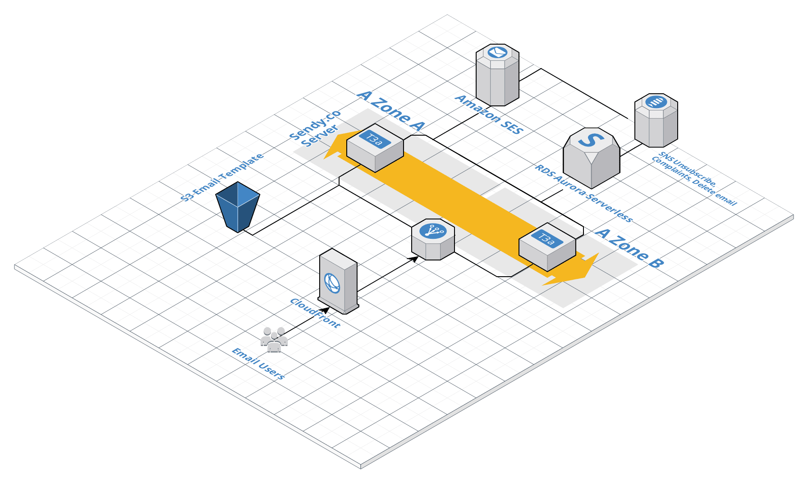
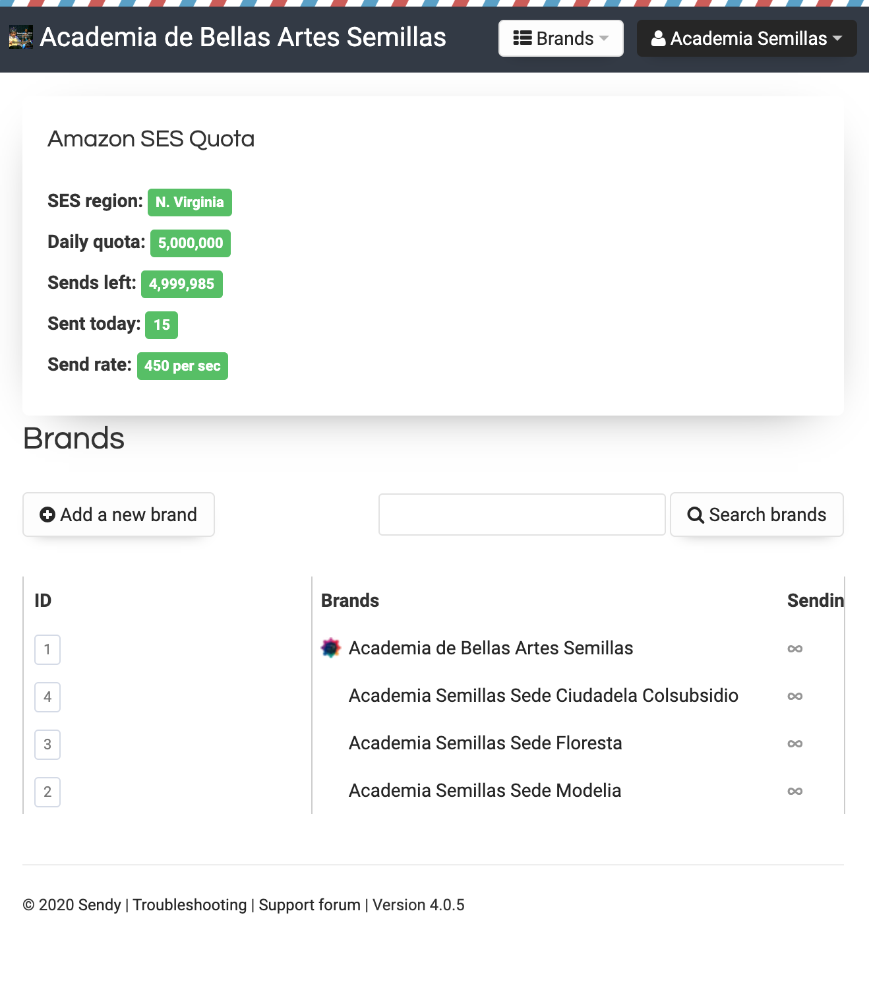
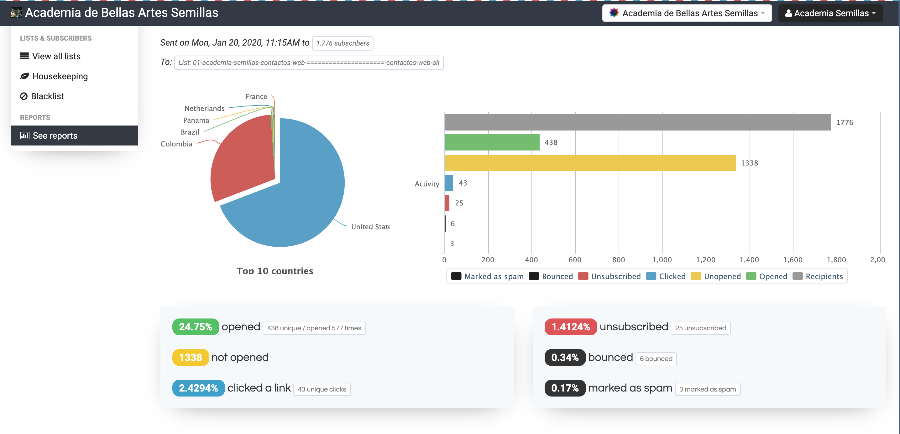

# Email Marketing Cloud Platform

**Email Marketing Cloud Platform** to manage and send our admissions campaigns, direct communication with students and parents. 
**Amazon Simple Email Service (Amazon SES)** Asia Pacific (Mumbai), Asia Pacific (Sydney), and EU (Frankfurt) Regions, in addition to the US East (Virginia), US West (Oregon), and Europe (Ireland) regions. 

**Used platforms:** AWS of course! 

**AWS Services:** Amazon SES, SNS, SMS, EC2, Route 53, CloudFront, Certificate Manager, S3, S3 Glacier, AWS Backup, Aurora RDS Serverless. 

**Software:** Sendy.co

----

----

----

